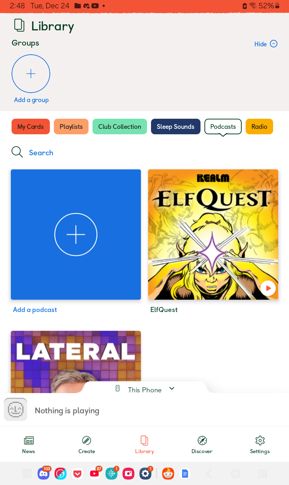
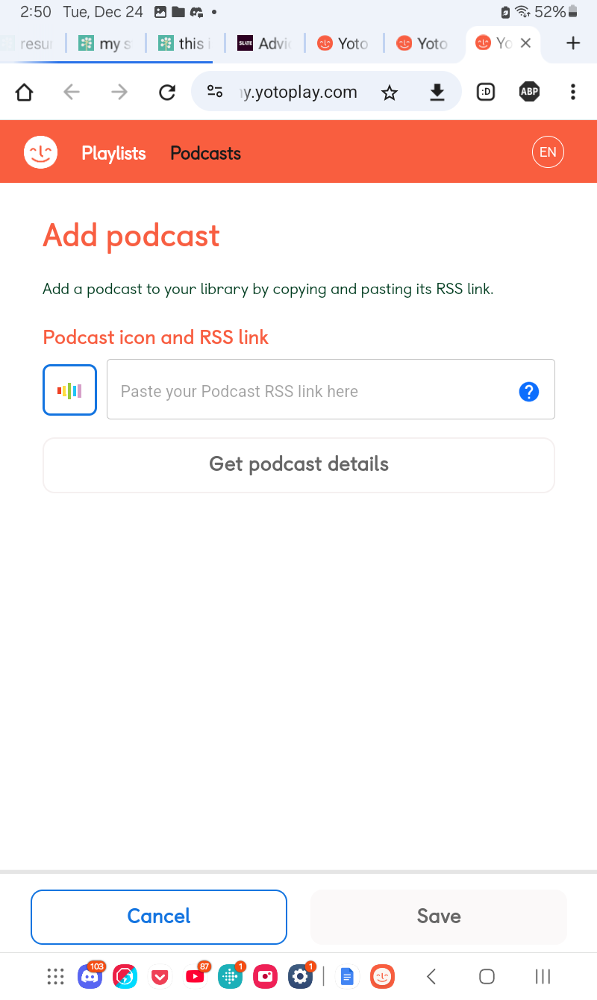
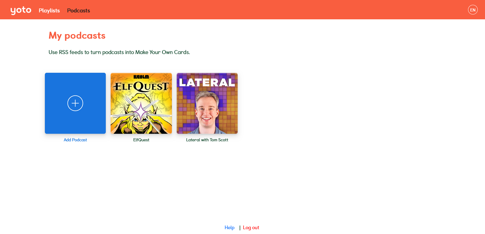
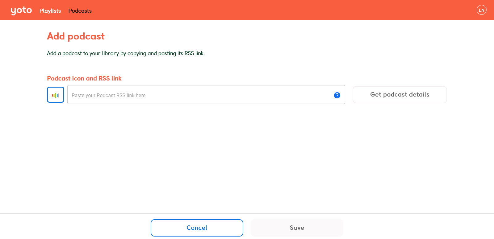
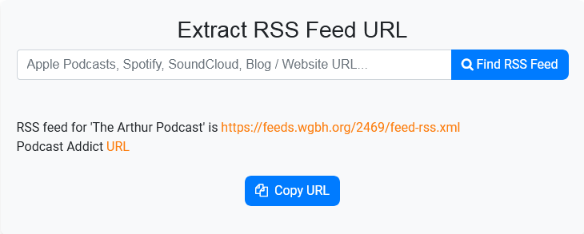
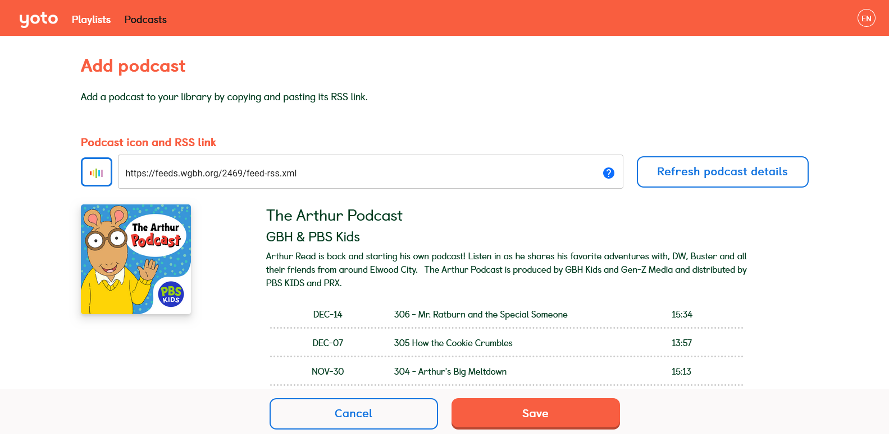
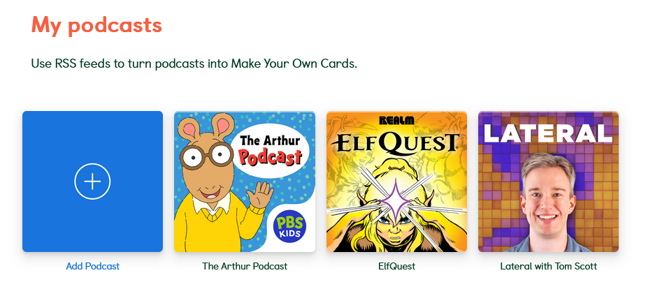
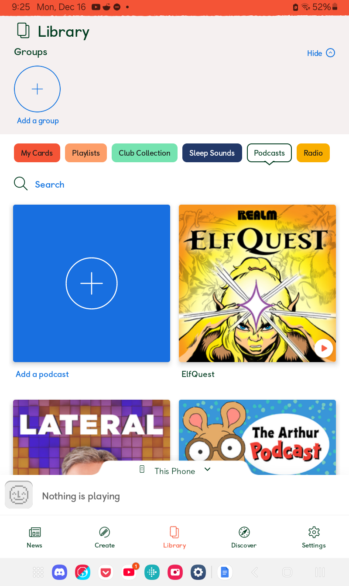
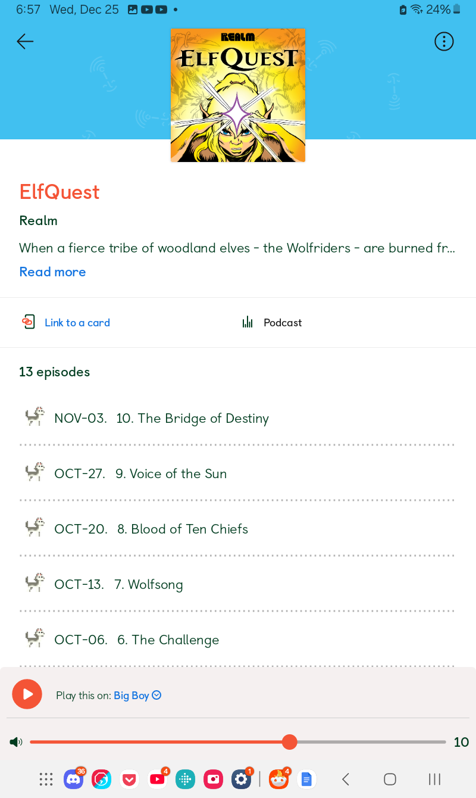
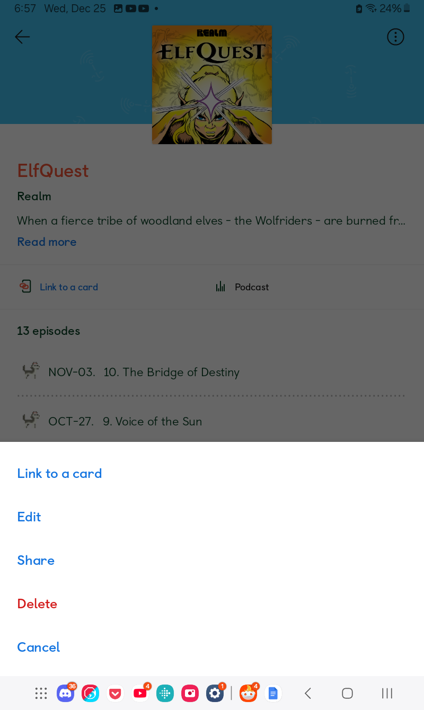

# Adding Podcasts to MYO

Author: [u/playchime](https://www.reddit.com/u/playchime)

Adding podcasts to cards is a bit unique, in that it has its own separate tab in the [My Yoto website](https://my.yotoplay.com/), and can’t just be added from the usual playlist creator. They also can’t be added in the app–going to add one in the app will just open My Yoto space in your web browser, so for this guide, phones/tablets and PCs can follow the same tutorial. Adding podcasts to MYO through the podcast interface in this way rather than by downloading the episodes allows Yoto to automatically refresh the card when new episodes come out, which is very handy.  

We’ll start by covering how to get to the podcasts section of My Yoto space on mobile, then computers, and then the instructions will be shared after that point.  

If you’re using your phone or tablet, you can start by opening up your app, and then selecting “Podcasts” from the row of coloured tabs above the card icons:

Now press the big blue button to add a podcast. This will open the My Yoto space in the web browser of your phone or tablet, already open to the podcasts tab/adding a new one:

If you’re on a computer/otherwise in-browser, then you’ll want to go to the [My Yoto website](https://my.yotoplay.com/) directly. You’ll find the “Podcasts” section right next to “Playlists” up at the top left of your screen, by the Yoto logo:

As you can see I already have two podcasts here (I’m an adult so these are appropriate selections aha), but unless you’ve already added some from Yoto’s in-app selections, then you’ll just have the big blue button, which we can press to start adding a new podcast.

From this point on, the instructions for computers and tablets/phones are exactly the same. To add a podcast to Yoto, you need an RSS link. It’s not important to understand the specifics of it, just to have it, so the easiest thing to do is to use a website that will find the correct link for you, such as [Get RSS Feed](https://getrssfeed.com/). All you need to do is paste in the link to a podcast from wherever you were listening to it (Spotify, iTunes, etc), and it will find the correct link to use with Yoto.
  

For the sake of a child-friendly example, I’m using the [Arthur podcast](https://podcasts.apple.com/ca/podcast/the-arthur-podcast/id1648149849). As you can see I’ve pasted the iTunes url into Get RSS:

And then pressed “Find RSS Feed”:
  

We can now press “Copy RSS” and navigate back to the My Yoto podcasts page, and paste it in:

You can also add a custom icon by pressing the rainbow coloured button to the left to open the icon interface:

And then press “Get Podcast Details”

Yoto will then find all the episodes (or as many as it can keep track of–there is a limit of only the 25 most recent episodes), and you can press “Save” to make them available for linking to a MYO card.

Linking the podcasts to a MYO card also works slightly differently than linking usual MYO playlists. We will still open up our Yoto app and use the bottom menu to go to the library, but you then need to select “Podcasts” from the row of coloured tabs above the playlist thumbnails:
   

You can then select the podcast you want to link to a MYO, and the process from there is the same as with playlists.  

Please note: Currently it is not possible to select which episodes of a podcast Yoto pulls, or to link individual episodes to a card. If you want more control over podcast content, you will need to download it first and go through the usual MYO playlist-making process.  

Additionally, it is possible to further customize podcast playlists as if they were standard MYO playlists by using the app. This is something I've only just discovered and am still experimenting with. If you're new to Yoto you may want to ignore this for now. If not,  start by going to your podcasts tab and selecting a podcast:

At the top right of the screen, you will see an icon of three stacked dots. Pressing it opens up this menu along the bottom of the screen:

Selecting the edit option here will open up the same playlist editor we’re able to use for standard MYO cards, which will allow for sorting the tracks in a custom order, adding individualized track icons, and even editing the title, cover image, and podcast description. It can then even be opened up in the My Yoto space using the “more options on website” link to access all the usual track and playlist settings not present in the app like looping a track or shuffling the playlist. As I'm still experimenting with this, I don't yet know how any of these affect the podcast in the long term–it is possible they will disable its ability to automatically update with new episodes. It’s a neat thing to mess around with though! Currently I expect editing podcasts in this way with the usual MYO editor turns them into standard MYO playlists. This is reflected in My Yoto space–a podcast I edited in this way moved from my podcasts tab into my playlists tab–but unusually is not reflected in the app, where it remained in my podcasts tab. So I can't say for sure!  

This potentially has merit as a way of circumventing the need to download podcast episodes as well if you just want a playlist of your favourites, as I expect with access to all the features of the playlist editor you could also delete episodes, but ofc there wouldn't be a way to grab earlier episodes than whatever you started with. Either way, I haven't tried deleting episodes yet. I'm gonna mess around with all of this over the next few days, but it was too interesting not to add now!