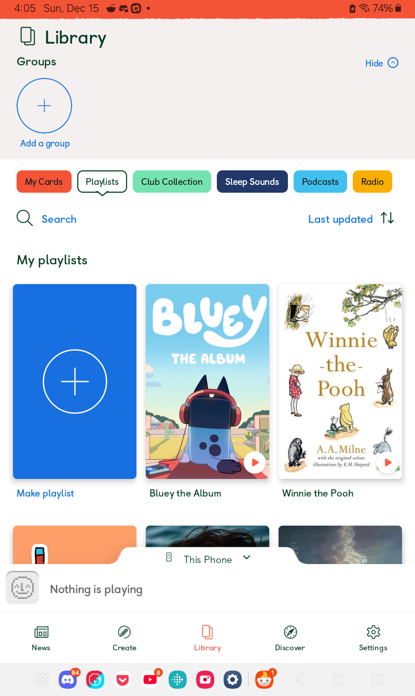
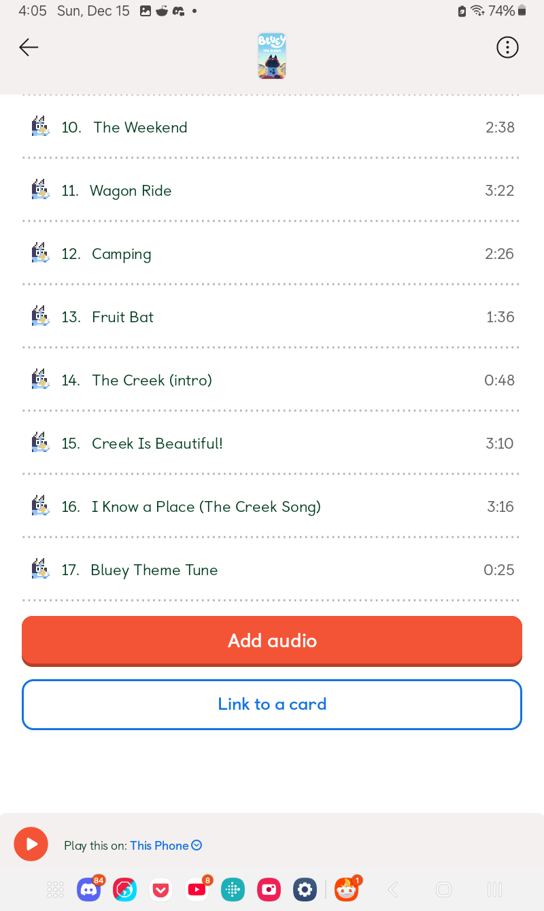

# Linking a Playlist to a MYO Card

Please note linking MYO cards must be done in the app. There is no way around using the app for this. It also requires wifi and bluetooth, or NFC (if you don’t know what NFC is don't worry about it–wifi is just fine!).  

This guide will also assume you have already downloaded the app, and have connected your Yoto to it. It is available on mobile and tablet devices on both iOS and Android, and should be in your app store of choice (iTunes, Google Play, etc). Instructions on linking your Yoto are in the app itself.  

This guide will also assume you already have a Yoto account, and a playlist ready to be linked. If you need to learn how to make a playlist, please see the [Making a MYO Playlist](making_a_myo_playlist.md) section.  

To link a MYO card, you will need to open the app on your smart device of choice (I use a Samsung minitab, so screenshots will be of the android tablet app, but it should look the same across devices), and navigate to the “Library” tab from the menu across the bottom of the app. By default this will open to your library of purchased Yoto cards. To get to your MYO playlists, look to the row of coloured tabs above the card thumbnails, and select “Playlists” to get to the MYO category.  
  

Here you can see the Bluey playlist I made in the MYO Playlist tutorial, alongside several other playlists I’ve already made. I’ll be linking the Bluey playlist, but you can pick whichever of your own playlists that you like.

If you scroll down to the bottom of the playlist, you’ll see options for “Add Audio” and “Link to a Card”. Add audio is for editing the playlist. We will press “Link to a Card” for now.

I actually don’t have my Yoto here with me as I’m taking the screenshots for this, so as you can see it is greyed out. In order for it to be available, you need to have your Yoto turned on and connected to wifi, which should return the button to its normal colour, which I believe is orange. You would then want to insert a blank MYO card (or one you want to overwrite the content of) into the card slot of your Yoto player, and press the “Use Your Yoto Player” button, which will use wifi and Bluetooth to link the the playlist you’ve made to the MYO card.

Please note you can write and rewrite a MYO card as many times and as often as you like! They do not run out of uses, and rewriting one won't delete the playlist that was originally on it, that will still be stored in your playlist library for later use unless you purposefully delete it.  

Now, for people using modern smartphones rather than a dinky tablet like myself, you will have a second option for linking on this screen that I am unable to screenshot, which I imagine will be labelled “Use your phone” or possibly “use NFC”. This is because modern phones have NFC built into them, meaning the phone can write to the card directly if the card is held close to/against it. I’m sure if you have this button and press it, the app will explain to you exactly how to position the card.
  
It's possible (likely even) that linking via NFC can be done without wifi. As I don’t have an NFC device I'm not able to test this–if anyone has a concrete answer please let me know!

Regardless, once you’ve linked your playlist to a MYO card, you will want to make sure that it’s downloaded to your player. Yoto doesn’t download content in all conditions, so the best way to make sure it downloads the content for offline use is to let the card play for a moment, remove any cards from the player (and stop any other audio), leave it turned on, and plug it into its charger. Please note the player needs to maintain a wifi connection to download content. If it is downloading, there should be a cloud icon on the screen. It doesn’t take very long to download if you have a good connection.
  
You can double-check if the content you have added has been downloaded by navigating to the settings of your player in the app. You will use the gear icon at the bottom of the app, then select your player, then “Audio Download Status” which shows what content is currently on the internal storage.