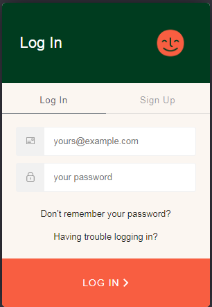
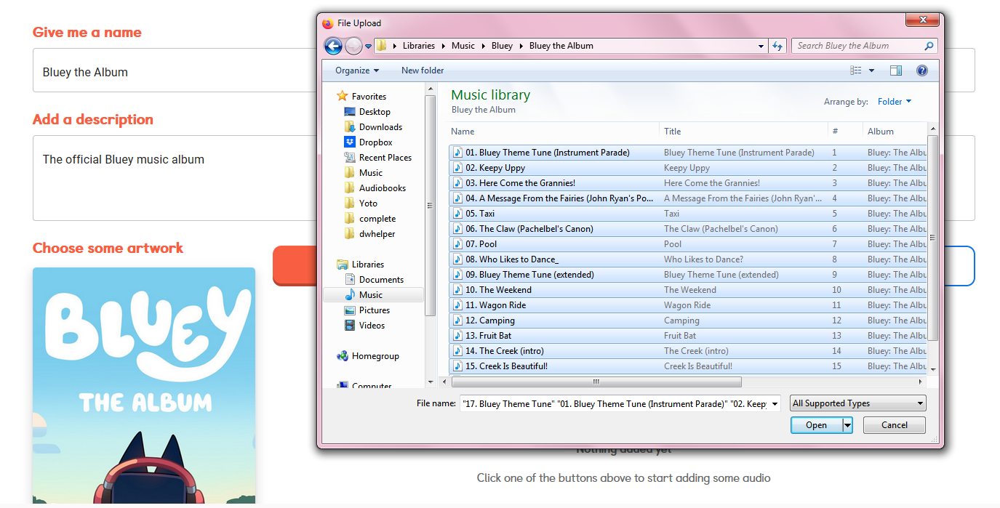
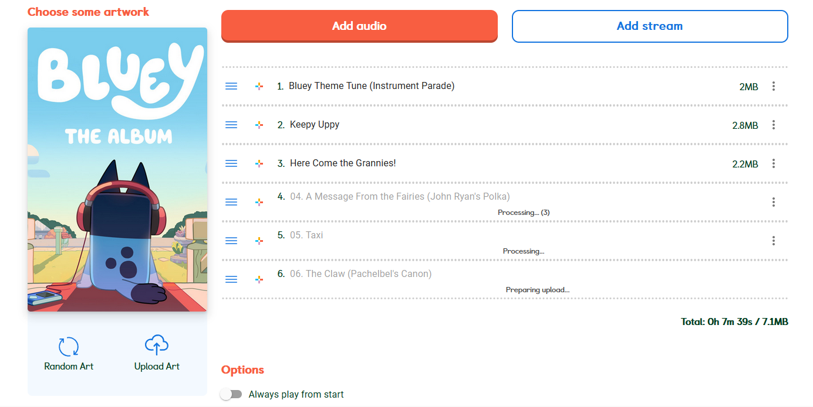
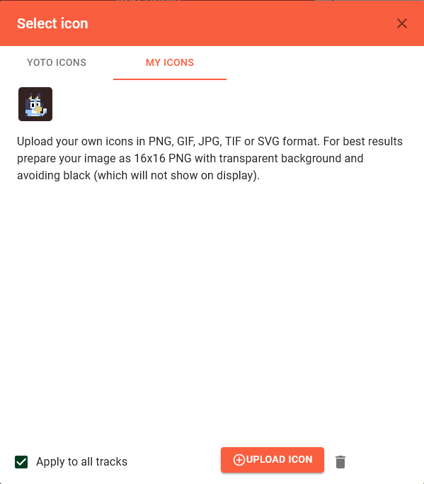
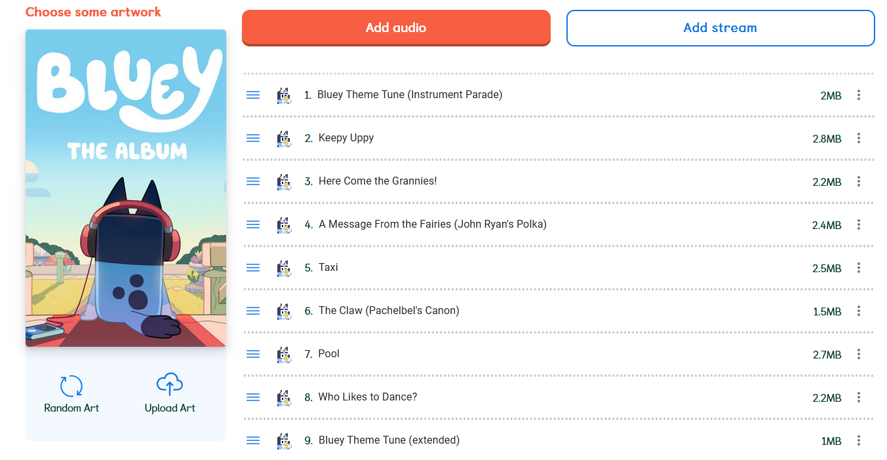
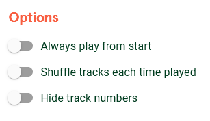
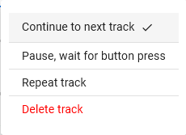
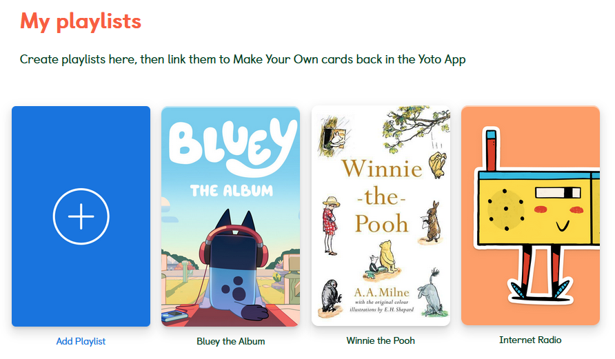

# Making a MYO Playlist - Using a Computer

In your web browser of choice, [follow this link to the My Yoto website](https://my.yotoplay.com/my-cards). If you’re not currently logged in, you will need to do that first.  
  

Once you are logged in, it looks like this:

Here I have two playlists I’ve made already, but If you haven’t made a playlist yet, you’ll only have the large blue button. You’ll want to click it to start making your first playlist.

This is the playlist screen. You have two options for adding audio to your playlist, “Add Audio” which is for adding MP3s, or “Add Stream” which is for adding radio stations (podcasts cannot be added from this screen). We will cover radio stations in a second guide. For now you will want to start by making a playlist of MP3s. If you do not have MP3s ready, please see the other information in this document for how to acquire MP3s and then come back here. If you have your MP3s ready, read on. 

Right now we want to:
- Name your playlist (this is mandatory in order to save it).  
- Upload a cover image so you can easily identify this playlist both here and in the app (optional)
- And add our MP3s

I will be assuming you know how to do a Google Images search and save an image to your PC in a place you know where to find it. With that in mind, all you need to do to add a cover image is press the cloud-shaped “Upload Art” button, and select your image in your computer’s file browser. You can also use the “Random Art” button to have Yoto select a random cover image for you from its default options, but I find these get same-y really fast.

Now you will need to add your MP3s. Yoto helpfully supports batch uploading, so this is very quick and easy. For this tutorial, I will be making a playlist for the Bluey music album, as I know that is a very popular MYO.

  

You can see here I’ve selected the entire album’s worth of files at once for batch uploading.

Yoto will now go through the process of uploading all of them one after the other, in alphabetical order. This takes a few minutes. If you want to upload multiple books/albums/etc to the same card, you’ll want to wait for the first one to finish uploading all of its tracks before adding another, or it starts to add them simultaneously and the tracks will be interspersed rather than in the correct order.

A few things to note:
- If any tracks do end up in the **wrong order**, you can click and hold on the three blue lines next to each track to drag them around and re-order them.
- If you **need to delete** any tracks, you can do so with the “...” icon to the far right of the track. The “...” menu will be discussed in further detail below.
- You can **rename** tracks by simply clicking into the track name and backspacing/typing accordingly.  

Now that we have our tracks, we now want to:
- Wait for Yoto to finish uploading all of the tracks
- (optional: add a second/third/etc set of tracks)    
- Add icons to our tracks so they can be identified    
- Finalize our playlist options
    
Now that we’ve waited for our tracks to finish uploading, it’s time to add icons! We will do this by pressing the multi-coloured + symbol next to each track name. It looks like this:

And will open the following icon interface:

As you can see, Yoto has a large library of icons already built in, and you will often be able to find something suitable without needing to add your own icons. However if you are doing a MYO of something like Bluey, where you might want icons of the specific characters, then you’ll want to visit [Yoto Icons](https://www.yotoicons.com/), a site where other Yoto users upload the icons they themselves have drawn. They have a wide variety of both character icons and general icons, so it’s always worth a look if you don’t see something in the Yoto interface that grabs you!  

You can upload custom icons by going to the “My Icons” tab of the icons interface.

You can see here I’ve decided to upload an icon of Bluey. And before I select it, I have also checked the “Apply to all tracks” box, which will put the same icon on every track on the playlist without my having to do it manually. As the icon is the only thing on the player that indicates what song is selected, I don’t recommend doing this for children though (I am just doing it for the tutorial).

As you can see, all of my tracks now have this icon of Bluey. Please note you do not have to give tracks an icon in order to save your playlist. It’s possible to save a playlist without adding icons/without adding all the icons, if you need to pause and save your work before you have time to add them all, or you just don’t want to use them. Tracks without icons will just display the coloured + sign when playing on the Yoto.  

Now we will move on to finalizing our playlist options! There’s actually two things we can do here, but we’ll start with the most obvious, this little panel of options at the bottom of the playlist interface:

- `Always play from start`: By default, Yoto cards resume playing from wherever they were last stopped when inserted into a Yoto player, so that if your child is listening to a story it will continue where they left it. Selecting this option will disable that, so when the card is inserted it always plays from the very beginning no matter where it left off.
- `Shuffle tracks each time played`: It’s Shuffle, just like in your music player/streaming of choice! When inserted, the card will start at a random track, and it will also pick a random track when skipping between songs. This also applies to turning the knob to seek certain tracks–they will appear in a random order. Excellent for music cards, but you definitely need to make sure all the icons are unique to avoid frustration!
- `Hide track numbers`: When turning the knob on the Yoto to seek tracks, it displays the number of the track overtop of the picture icon, so you can see how far ahead you’re seeking. It is useful to disable this for very young children, so they can view the icon more clearly, since the numbers will not yet be useful to them.

Now we have the second, more hidden options for finalizing our playlist, the “...” icon next to each track:

Which opens this small additional menu:

These settings are per individual track. By default, every track will be set to “continue to next track”, which is normal play. However if you like, you can change any given track to need a button press interaction, or to loop by selecting the Repeat track option, which would be useful if you are making cards of background noise or music, such as for sleeping. This is also how you can delete tracks if needed.  

Once we’re happy with all our playlist settings, we will now press the large orange “Create” icon, which will save the playlist to our account.
  

And now it should be in our playlists! As seen below: 
  

We can now move on to [linking a playlist to a MYO card](linking_a_playlist_to_a_myo_card.md). 